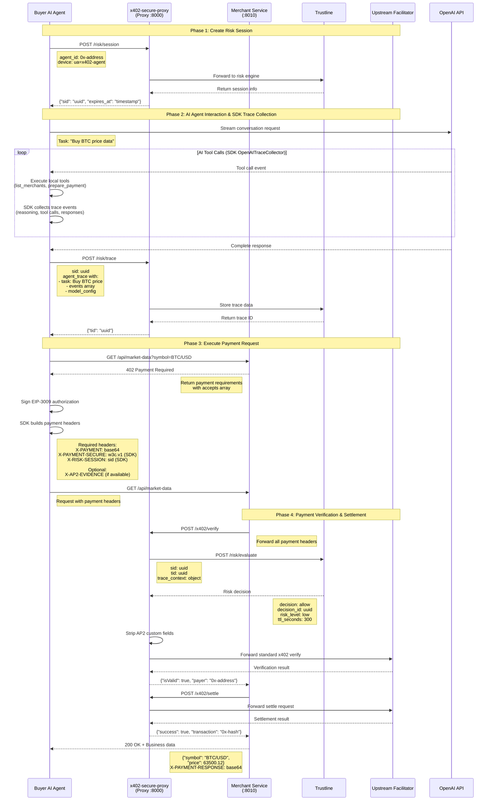

# x402-secure

[](https://github.com/t54-labs/x402-secure/actions/workflows/test.yml)
[](https://opensource.org/licenses/Apache-2.0)
[](https://www.python.org/downloads/)
[](https://x402-secure.t54.ai/)

**Open-Source SDK & Proxy for Secure Agent Payments on x402 — Powered by Trustline from [t54](https://t54.ai)**

🚀 **Production Proxy Available**: https://x402-proxy.t54.ai

## 🌟 The Trustline + x402 Stack

**Trustline** is t54's agent-native risk engine that makes autonomous AI payments safe and reliable. It provides:

- **Logic-level Risk Assessment**: Analyzes complete agent reasoning chains, not just transactions
- **Real-time Fraud Detection**: Identifies compromised agents, prompt injections, and malicious patterns
- **Dispute Resolution**: Cryptographic evidence of agent behavior for clear liability boundaries
- **Regulatory Compliance**: Built for the agentic economy with audit trails and compliance tools

**x402-secure** is the open-source gateway that connects your AI agents to Trustline's risk infrastructure:

- 🤖 **Agent SDK**: Automatic reasoning trace collection (OpenAI today, LangChain/AutoGPT coming)
- 🔄 **Facilitator Proxy**: Seamless integration with x402 payment protocol
- ⚖️ **Liability Protection**: Clear responsibility boundaries backed by evidence
- 🚀 **Production Ready**: Battle-tested infrastructure handling millions in agent transactions

**❤️ Developed by [t54 labs](https://t54.ai)**

## 🚀 Quickstart: Run the Proxy Locally

Want to quickly test the proxy on your machine? Follow these steps:

### Prerequisites
- **Install uv** (macOS/Linux): `curl -LsSf https://astral.sh/uv/install.sh | sh`
- **Python 3.11 or 3.12**

### Setup
```bash
# 1. Clone and navigate to the repo
git clone https://github.com/t54labs/x402-secure
cd x402-secure

# 2. Create virtual environment and install dependencies
uv venv
uv sync

# 3. Configure environment
cp env.example .env
```

Edit `.env` and set:
```bash
PROXY_LOCAL_RISK=1
PROXY_UPSTREAM_VERIFY_URL=https://x402.org/facilitator/verify
PROXY_UPSTREAM_SETTLE_URL=https://x402.org/facilitator/settle
```

### Run the Proxy
```bash
# Start the proxy
uv run python run_facilitator_proxy.py

# Health check (in another terminal)
curl http://localhost:8000/health
```

### Common Issues
- **"risk endpoints 500"**: Ensure `PROXY_LOCAL_RISK=1` for local mode, or set `RISK_ENGINE_URL` for forward mode.
- **Port in use**: Adjust `PROXY_PORT` in `.env` or free port 8000.

### Next Steps
- For full development flow (seller + buyer examples), see [docs/DEVELOPMENT.md](docs/DEVELOPMENT.md)
- For agent integration examples, see [packages/x402-secure/examples/](packages/x402-secure/examples/)

---

## 🤔 Why you need x402-secure?

### The Problem

**If you're building an AI agent that makes payments:**
- ❓ What if your agent makes unauthorized purchases?
- ❓ Who pays when something goes wrong?
- ❓ How do you prove your agent acted reasonably?

**If you're building APIs/services that accept agent payments:**
- ❓ How do you know agent payments are legitimate?
- ❓ What if users dispute every transaction?
- ❓ How do you protect against malicious agents?

### The Solution

x402-secure provides **clear responsibility boundaries** through:
- 📝 **Trace Collection**: Captures complete AI reasoning process
- 🛡️ **Risk Assessment**: Evaluates agent behavior before payment
- 💾 **Evidence Storage**: Proves agents acted within bounds
- ⚖️ **Dispute Protection**: Clear evidence for resolution

## 👨‍💻 For AI Agent Developers

> "I'm building an AI agent that needs to make payments on behalf of users"

### What You Get
- ✅ **Automatic liability protection** - Approved transactions are protected from disputes
- ✅ **Simple integration** - Just a few lines of code
- ✅ **Evidence storage** - Complete reasoning chain for every transaction
- ✅ **Pre-payment risk check** - Risky transactions blocked before money moves

### Quick Integration (5 minutes)

> **Note on Package Naming**: The PyPI package name is `x402-secure`, but the import module is `x402_secure_client`.

```python
# 1. Install SDK
pip install x402-secure

# 2. Initialize buyer client
from x402_secure_client import BuyerClient, BuyerConfig, OpenAITraceCollector

# Configure buyer client
buyer = BuyerClient(BuyerConfig(
    seller_base_url="https://api.example.com",
    agent_gateway_url="https://x402-proxy.t54.ai",
    buyer_private_key=YOUR_PRIVATE_KEY
))

# 3. Create risk session
session = await buyer.create_risk_session(
    app_id="my-agent-v1"
)
sid = session['sid']

# 4. Collect AI reasoning with OpenAI
tracer = OpenAITraceCollector()

# Your OpenAI streaming call with tool execution
with openai.responses.stream(...) as stream:
    result = await tracer.process_stream(
        stream=stream,
        tools={"make_purchase": make_purchase_function}
    )

# 5. Store trace and get trace ID
tid = await buyer.store_agent_trace(
    sid=sid,
    task="Purchase item",
    params={"item": "coffee maker"},
    events=tracer.events
)

# 6. Execute payment with protection
payment_result = await buyer.execute_with_tid(
    endpoint="/api/purchase",
    task="Purchase item",
    params={"item": "coffee maker"},
    sid=sid,
    tid=tid
)

print(f"Payment completed: {payment_result}")
```

### Complete Flow Example

```python
# Simplified helper for common use case
from x402_secure_client import run_agent_payment

# All-in-one helper that handles the complete flow
result = await run_agent_payment(
    gateway_url="https://x402-proxy.t54.ai",
    seller_base_url="https://api.example.com",
    buyer_private_key=YOUR_PRIVATE_KEY,
    endpoint="/api/purchase",
    task="Buy coffee maker",
    params={"item_id": "12345"},
    events=tracer.events  # Your collected AI trace
)
```

### Liability Protection

| Scenario | Without x402-secure | With x402-secure |
|----------|-------------------|------------------|
| Agent tricked by prompt injection | ❌ You pay | ✅ Protected |
| Agent exceeds user's intent | ❌ You pay | ✅ Protected |
| Agent makes reasonable decision | ❌ You prove it | ✅ Evidence stored |
| Malicious user disputes | ❌ You fight it | ✅ Clear Liability |

[📖 Complete Buyer Integration Guide →](docs/BUYER_INTEGRATION.md)

## 🏪 For API/Service Providers

> "I'm building a service that accepts payments from AI agents"

### What You Get
- ✅ **Risk scores for every transaction** - Know which payments to trust
- ✅ **Protection from disputes** - Evidence of agent behavior
- ✅ **Simple integration** - Standard x402 with risk headers
- ✅ **Higher conversion** - Don't block all agents, just risky ones

### Quick Integration (10 minutes)

```python
# 1. Install SDK
pip install x402-secure

# 2. Add to your FastAPI app
from fastapi import FastAPI, Request
from fastapi.responses import JSONResponse
from x402_secure_client import SellerClient

app = FastAPI()

# Initialize seller client with your proxy endpoint
seller = SellerClient("https://x402-proxy.t54.ai/x402")

@app.get("/api/your-service")
async def your_api(request: Request, param: str):
    # Define payment requirements
    payment_requirements = {
        "scheme": "exact",
        "network": "base-sepolia",  # or "base" for mainnet
        "maxAmountRequired": "100000",  # 0.10 USDC in atomic units
        "resource": str(request.url),
        "payTo": "0xYourWalletAddress",
        "asset": "0x036CbD53842c5426634e7929541eC2318f3dCF7e",  # USDC
    }

    # Check for payment headers
    x_payment = request.headers.get("X-PAYMENT")
    x_payment_secure = request.headers.get("X-PAYMENT-SECURE")
    risk_session = request.headers.get("X-RISK-SESSION")

    if not all([x_payment, x_payment_secure, risk_session]):
        # Return 402 Payment Required
        return JSONResponse(
            {"accepts": [payment_requirements], "error": "Payment required"},
            status_code=402
        )

    # Verify and settle payment
    try:
        import base64, json
        payment_data = json.loads(base64.b64decode(x_payment))

        result = await seller.verify_then_settle(
            payment_data,
            payment_requirements,
            x_payment_b64=x_payment,
            origin=request.headers.get("Origin"),
            x_payment_secure=x_payment_secure,
            risk_sid=risk_session
        )

        # Payment successful - deliver your service
        service_result = {"data": f"Processed: {param}"}

        return JSONResponse(
            service_result,
            headers={"X-PAYMENT-RESPONSE": base64.b64encode(json.dumps(result).encode()).decode()}
        )

    except Exception as e:
        return JSONResponse({"error": str(e)}, status_code=402)
```

### Risk Scoring

Every payment response will include a 'risk_level' with ENUM value options:
- 🟢 **Low**: Clear reasoning, expected behavior
- 🟡 **Medium**: Some anomalies, proceed with caution
- 🔴 **High**: Suspicious patterns, consider blocking

### Dispute Protection

| Scenario | Without x402-secure | With x402-secure |
|----------|-------------------|------------------|
| User claims "agent did this without permission" | ❌ You refund | ✅ Show reasoning trace, merchant doesn't need to refund |
| Agent was compromised | ❌ You can't tell | ✅ Risk score warned you |
| Legitimate agent error | ❌ You eat the cost | ✅ Shared liability |
| Serial disputor | ❌ No evidence | ✅ Pattern detection |

[📖 Complete Seller Integration Guide →](docs/SELLER_INTEGRATION.md)

## 🔧 How It Works



## 🤝 Support

- 📧 **Email**: support@t54.ai
- 💬 **Discord**: [Join our community](https://discord.gg/t54labs)
- 📖 **Docs**: [docs.t54.ai](https://docs.t54.ai)
- 🐛 **Issues**: [GitHub Issues](https://github.com/t54-labs/x402-secure/issues)

---

**Built with ❤️ by [t54 labs](https://t54.ai)**

*For contribution guidelines, deployment instructions, and technical architecture, see our [Developer Documentation](docs/DEVELOPMENT.md)*
