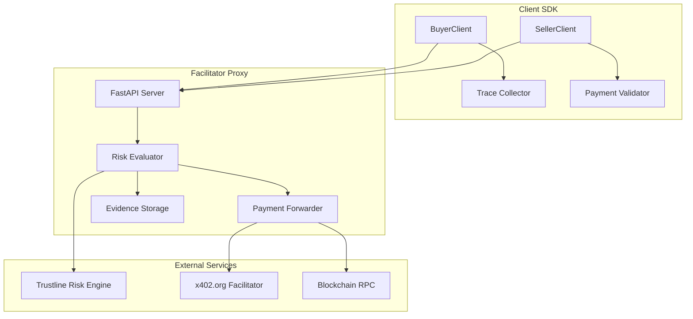
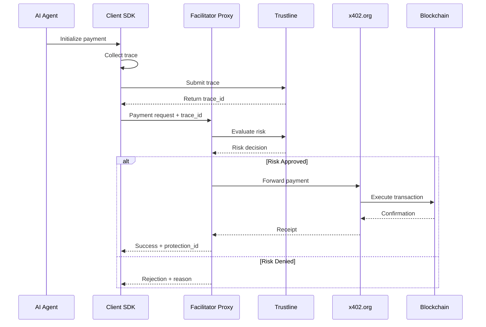

# Development & Deployment Guide

This guide is for developers who want to contribute to x402-secure or deploy their own instance.

## Table of Contents

1. [Architecture Overview](#architecture-overview)
2. [Development Setup](#development-setup)
3. [Self-Hosting Guide](#self-hosting-guide)
4. [Contributing](#contributing)
5. [Technical Details](#technical-details)

## Architecture Overview

### System Components



### Request Flow



## Development Setup

### Prerequisites

- Python 3.11+
- `uv` package manager
- Git
- Docker (optional)

### 1. Clone Repository

```bash
git clone https://github.com/t54labs/x402-secure
cd x402-secure
```

### 2. Install Dependencies

```bash
# Install uv if not already installed
curl -LsSf https://astral.sh/uv/install.sh | sh

# Create virtual environment and install dependencies
uv venv
source .venv/bin/activate  # On Windows: .venv\Scripts\activate
uv sync
```

### 3. Environment Configuration

```bash
# Copy example env file
cp env.example .env

# Edit .env with your configuration
# Required for development:
PROXY_LOCAL_RISK=1  # Use local risk storage for development
PROXY_PORT=8000
PROXY_UPSTREAM_VERIFY_URL=https://x402.org/facilitator/verify
PROXY_UPSTREAM_SETTLE_URL=https://x402.org/facilitator/settle

# Optional: Use external Trustline (production mode)
# PROXY_LOCAL_RISK=0
# RISK_ENGINE_URL=<TRUSTLINE_API_URL>
# RISK_INTERNAL_TOKEN=your_token
```

### 4. Run Development Server

```bash
# Start the proxy server
uv run python run_facilitator_proxy.py

# In another terminal, start example seller
uv run uvicorn --app-dir packages/x402-secure/examples seller_integration:app --port 8010

# Run example buyer agent
AGENT_GATEWAY_URL=http://localhost:8000 \
SELLER_BASE_URL=http://localhost:8010 \
uv run python packages/x402-secure/examples/buyer_agent_openai.py
```

### 5. Running Tests

```bash
# Run all tests
uv run pytest

# Run specific test file
uv run pytest tests/test_proxy.py

# Run with coverage
uv run pytest --cov=x402_secure --cov-report=html
```

## Self-Hosting Guide

### Option 1: Docker Deployment

```yaml
# docker-compose.yml
version: '3.8'

services:
  proxy:
    image: ghcr.io/t54labs/x402-secure-proxy:latest
    ports:
      - "8000:8000"
    environment:
      - PROXY_LOCAL_RISK=0
      - RISK_ENGINE_URL=<TRUSTLINE_API_URL>
      - PROXY_UPSTREAM_VERIFY_URL=https://x402.org/facilitator/verify
      - PROXY_UPSTREAM_SETTLE_URL=https://x402.org/facilitator/settle
      - RISK_INTERNAL_TOKEN=${RISK_INTERNAL_TOKEN}
    restart: unless-stopped
```

```bash
# Start services
docker-compose up -d

# View logs
docker-compose logs -f proxy
```

### Option 2: Kubernetes Deployment

```yaml
# k8s/deployment.yaml
apiVersion: apps/v1
kind: Deployment
metadata:
  name: x402-secure-proxy
spec:
  replicas: 3
  selector:
    matchLabels:
      app: x402-secure-proxy
  template:
    metadata:
      labels:
        app: x402-secure-proxy
    spec:
      containers:
      - name: proxy
        image: ghcr.io/t54labs/x402-secure-proxy:latest
        ports:
        - containerPort: 8000
        env:
        - name: PROXY_LOCAL_RISK
          value: "0"
        - name: RISK_ENGINE_URL
          value: "<TRUSTLINE_API_URL>"
        - name: RISK_INTERNAL_TOKEN
          valueFrom:
            secretKeyRef:
              name: x402-secure-secrets
              key: risk-token
        resources:
          requests:
            memory: "256Mi"
            cpu: "250m"
          limits:
            memory: "512Mi"
            cpu: "500m"
---
apiVersion: v1
kind: Service
metadata:
  name: x402-secure-proxy
spec:
  selector:
    app: x402-secure-proxy
  ports:
  - port: 80
    targetPort: 8000
```

### Option 3: Manual Deployment

```bash
# On your server
git clone https://github.com/t54labs/x402-secure
cd x402-secure

# Install dependencies
pip install -r requirements.txt

# Configure environment
export PROXY_LOCAL_RISK=0
export RISK_ENGINE_URL=<TRUSTLINE_API_URL>
export RISK_INTERNAL_TOKEN=your_token
export PROXY_UPSTREAM_VERIFY_URL=https://x402.org/facilitator/verify
export PROXY_UPSTREAM_SETTLE_URL=https://x402.org/facilitator/settle

# Run with gunicorn (production)
gunicorn -w 4 -k uvicorn.workers.UvicornWorker \
  --bind 0.0.0.0:8000 \
  --access-logfile - \
  --error-logfile - \
  run_facilitator_proxy:app
```

### Monitoring & Observability

```python
# Add to your deployment
from prometheus_client import Counter, Histogram, generate_latest
import time

# Metrics
payment_requests = Counter('payment_requests_total', 'Total payment requests')
payment_success = Counter('payment_success_total', 'Successful payments')
payment_failed = Counter('payment_failed_total', 'Failed payments')
risk_evaluation_time = Histogram('risk_evaluation_seconds', 'Risk evaluation time')

# Instrument your code
@app.post("/x402/verify")
async def verify_payment(request: Request):
    payment_requests.inc()
    
    with risk_evaluation_time.time():
        # ... risk evaluation logic
        pass
    
    if approved:
        payment_success.inc()
    else:
        payment_failed.inc()

# Metrics endpoint
@app.get("/metrics")
async def metrics():
    return Response(generate_latest(), media_type="text/plain")
```

## Contributing

### Development Workflow

1. **Fork the repository**
   ```bash
   # Fork on GitHub, then clone
   git clone https://github.com/YOUR_USERNAME/x402-secure
   cd x402-secure
   ```

2. **Create a feature branch**
   ```bash
   git checkout -b feature/your-feature-name
   ```

3. **Make your changes**
   - Write tests for new functionality
   - Update documentation
   - Follow code style guidelines

4. **Run tests and linting**
   ```bash
   # Run tests
   uv run pytest
   
   # Run linting
   uv run ruff check .
   uv run mypy .
   ```

5. **Submit a pull request**
   - Clear description of changes
   - Link to any related issues
   - Ensure CI passes

### Code Style

- Use Black for formatting
- Type hints for all functions
- Docstrings for public APIs
- Meaningful variable names

### Testing Guidelines

```python
# Example test structure
import pytest
from x402_secure_client import BuyerClient

class TestBuyerClient:
    @pytest.fixture
    def client(self):
        return BuyerClient(
            proxy_url="http://test.proxy",
            private_key="0x" + "00" * 32
        )
    
    @pytest.mark.asyncio
    async def test_protected_payment(self, client, mock_trace):
        result = await client.protected_payment(
            merchant="test.com",
            amount="10.00",
            reason="Test payment",
            trace=mock_trace
        )
        
        assert result.approved
        assert result.protection_id is not None
```

## Technical Details

### Client SDK Architecture

#### Trace Collection

```python
# How trace collection works internally
class OpenAITraceCollector:
    def __init__(self):
        self.events = []
        self.context = {}
    
    async def trace(self):
        # Context manager for automatic collection
        self.start_trace()
        try:
            yield self
        finally:
            self.end_trace()
    
    def collect_event(self, event_type: str, data: dict):
        self.events.append({
            "type": event_type,
            "timestamp": time.time(),
            "data": data,
            "context": self.context.copy()
        })
```

#### Risk Client

```python
# Risk session management
class RiskClient:
    async def create_session(self, **kwargs) -> Session:
        response = await self.http.post("/risk/session", json=kwargs)
        return Session(**response.json())
    
    async def submit_trace(self, session_id: str, events: List[dict]) -> str:
        response = await self.http.post(
            f"/risk/trace/{session_id}",
            json={"events": events}
        )
        return response.json()["trace_id"]
```

### Proxy Implementation

#### Header Processing

```python
# How the proxy processes payment headers
async def process_payment_headers(request: Request) -> PaymentInfo:
    # Extract headers
    receipt = request.headers.get("X-Payment-Receipt")
    signature = request.headers.get("X-Payment-Signature") 
    risk_session = request.headers.get("X-Risk-Session")
    secure_context = request.headers.get("X-Payment-Secure")
    
    # Validate signature
    if not verify_signature(receipt, signature):
        raise InvalidSignatureError()
    
    # Parse trace context
    trace_info = parse_trace_context(secure_context)
    
    return PaymentInfo(
        receipt=receipt,
        signature=signature,
        risk_session=risk_session,
        trace_id=trace_info.get("tid")
    )
```

#### Risk Evaluation

```python
# Risk evaluation logic
async def evaluate_risk(payment_info: PaymentInfo) -> RiskDecision:
    # Call Trustline API
    response = await trustline_client.post(
        "/risk/evaluate",
        json={
            "session_id": payment_info.risk_session,
            "trace_id": payment_info.trace_id,
            "amount": payment_info.amount,
            "merchant": payment_info.merchant
        }
    )
    
    risk_data = response.json()
    
    return RiskDecision(
        approved=risk_data["risk_score"] < 0.8,
        score=risk_data["risk_score"],
        factors=risk_data["factors"],
        evidence_id=risk_data["evidence_id"]
    )
```

### Security Considerations

#### Signature Verification

```python
# Payment signature verification
from eth_account.messages import encode_defunct
from eth_account import Account

def verify_payment_signature(
    receipt: str,
    signature: str,
    expected_signer: str
) -> bool:
    # Decode receipt
    receipt_data = base64.b64decode(receipt)
    receipt_json = json.loads(receipt_data)
    
    # Create message hash
    message = encode_defunct(receipt_data)
    
    # Recover signer
    signer = Account.recover_message(message, signature=signature)
    
    return signer.lower() == expected_signer.lower()
```

#### Rate Limiting

```python
# Implement rate limiting
from slowapi import Limiter
from slowapi.util import get_remote_address

limiter = Limiter(key_func=get_remote_address)

@app.post("/x402/verify")
@limiter.limit("100/minute")
async def verify_payment(request: Request):
    # ... payment logic
    pass
```

### Performance Optimization

#### Caching

```python
# Cache validation results
from cachetools import TTLCache
import asyncio

class ValidationCache:
    def __init__(self, ttl=300):  # 5 minute TTL
        self.cache = TTLCache(maxsize=10000, ttl=ttl)
        self.locks = {}
    
    async def get_or_compute(self, key: str, compute_fn):
        if key in self.cache:
            return self.cache[key]
        
        # Prevent duplicate computation
        if key not in self.locks:
            self.locks[key] = asyncio.Lock()
        
        async with self.locks[key]:
            # Double-check after acquiring lock
            if key in self.cache:
                return self.cache[key]
            
            # Compute and cache
            result = await compute_fn()
            self.cache[key] = result
            return result
```

#### Connection Pooling

```python
# HTTP client with connection pooling
import httpx

class PooledHTTPClient:
    def __init__(self):
        self.client = httpx.AsyncClient(
            limits=httpx.Limits(
                max_keepalive_connections=20,
                max_connections=100,
                keepalive_expiry=30
            ),
            timeout=httpx.Timeout(10.0)
        )
    
    async def __aenter__(self):
        return self.client
    
    async def __aexit__(self, *args):
        await self.client.aclose()
```

### Troubleshooting

#### Common Issues

1. **Connection Errors**
   ```python
   # Add retry logic
   from tenacity import retry, stop_after_attempt, wait_exponential
   
   @retry(
       stop=stop_after_attempt(3),
       wait=wait_exponential(multiplier=1, min=4, max=10)
   )
   async def call_risk_engine(data):
       async with httpx.AsyncClient() as client:
           return await client.post(RISK_ENGINE_URL, json=data)
   ```

2. **Signature Validation Failures**
   ```python
   # Debug signature issues
   import logging
   
   logger = logging.getLogger(__name__)
   
   def debug_signature_failure(receipt, signature, expected_signer):
       logger.error(f"Signature validation failed")
       logger.error(f"Receipt: {receipt[:50]}...")
       logger.error(f"Signature: {signature}")
       logger.error(f"Expected signer: {expected_signer}")
       
       # Try to recover actual signer
       try:
           actual_signer = recover_signer(receipt, signature)
           logger.error(f"Actual signer: {actual_signer}")
       except Exception as e:
           logger.error(f"Failed to recover signer: {e}")
   ```

3. **Performance Issues**
   ```python
   # Profile slow endpoints
   import time
   from contextvars import ContextVar
   
   request_id = ContextVar('request_id', default=None)
   
   @app.middleware("http")
   async def timing_middleware(request: Request, call_next):
       start = time.time()
       request_id.set(str(uuid.uuid4()))
       
       response = await call_next(request)
       
       duration = time.time() - start
       if duration > 1.0:  # Log slow requests
           logger.warning(
               f"Slow request: {request.url.path} "
               f"took {duration:.2f}s "
               f"(request_id: {request_id.get()})"
           )
       
       return response
   ```

## Support

- 💬 Developer Discord: [Join #dev channel](https://discord.gg/x402secure)
- 🐛 Issues: [GitHub Issues](https://github.com/t54labs/x402-secure/issues)
- 📧 Technical Support: dev@x402-secure.com
