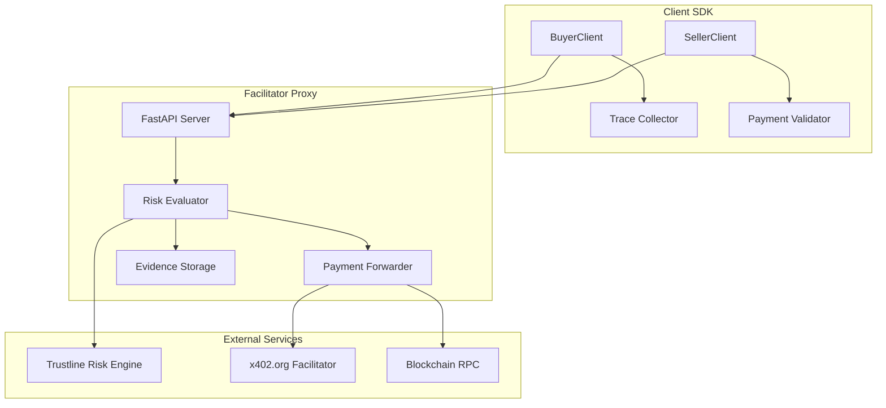
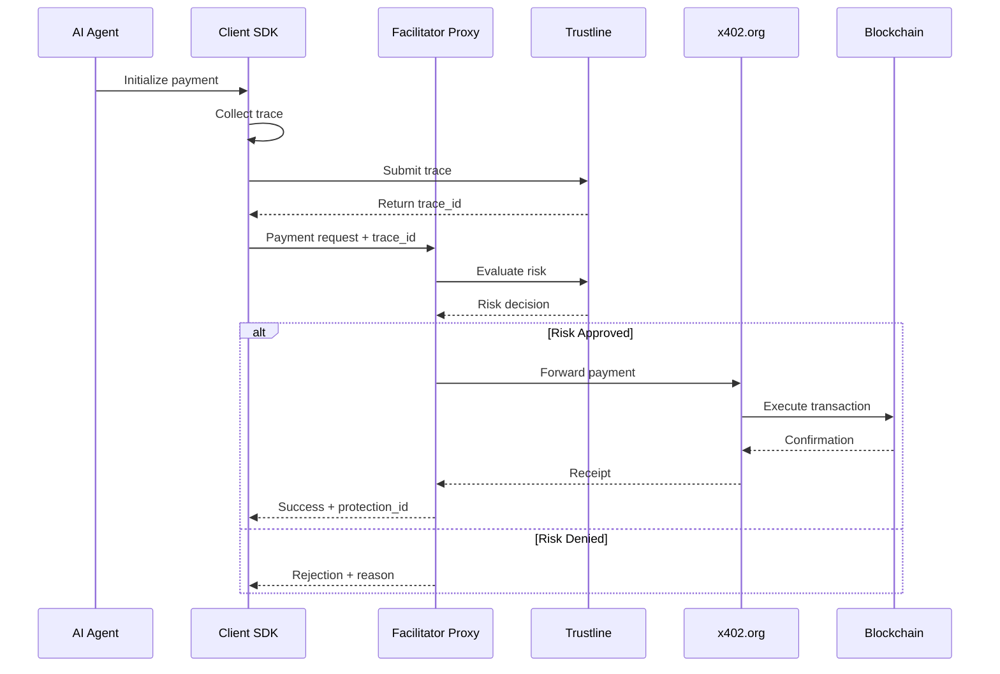

# Development & Deployment Guide

This guide is for developers who want to contribute to x402-secure or deploy their own instance.

## Table of Contents

1. [Architecture Overview](#architecture-overview)
2. [Development Setup](#development-setup)
3. [Self-Hosting Guide](#self-hosting-guide)
4. [Contributing](#contributing)
5. [Technical Details](#technical-details)

## Architecture Overview

### System Components



### Request Flow



## Development Setup

### Prerequisites

- Python 3.11+
- `uv` package manager
- Git
- Docker (optional)

### 1. Clone Repository

```bash
git clone https://github.com/t54labs/x402-secure
cd x402-secure
```

### 2. Install Dependencies

> **Important**: Use `uv sync` to install all workspace dependencies. This command installs the local packages (`x402-proxy` and `x402-secure`) in editable mode as defined in `[tool.uv.sources]` in the root `pyproject.toml`.

```bash
# Install uv if not already installed
curl -LsSf https://astral.sh/uv/install.sh | sh

# Create virtual environment and install dependencies
uv venv
source .venv/bin/activate  # On Windows: .venv\Scripts\activate
uv sync
```

The `uv sync` command:
- Installs all dependencies from `pyproject.toml` and `uv.lock`
- Automatically installs local packages (`x402-proxy` and `x402-secure`) in editable mode
- Ensures consistent dependency versions across environments

### 3. Environment Configuration

```bash
# Copy example env file
cp env.example .env

# Edit .env with your configuration
# Required for development:
PROXY_LOCAL_RISK=1  # Use local risk storage for development
PROXY_PORT=8000
PROXY_UPSTREAM_VERIFY_URL=https://x402.org/facilitator/verify
PROXY_UPSTREAM_SETTLE_URL=https://x402.org/facilitator/settle

# Optional: Use external Trustline (production mode)
# PROXY_LOCAL_RISK=0
# RISK_ENGINE_URL=<TRUSTLINE_API_URL>
# RISK_INTERNAL_TOKEN=your_token
```

### 4. Run Development Server

```bash
# Start the proxy server
uv run python run_facilitator_proxy.py

# In another terminal, start example seller
uv run uvicorn --app-dir packages/x402-secure/examples seller_integration:app --port 8010

# Run example buyer agent
AGENT_GATEWAY_URL=http://localhost:8000 \
SELLER_BASE_URL=http://localhost:8010 \
uv run python packages/x402-secure/examples/buyer_agent_openai.py
```

### 5. Running Tests

```bash
# Run all tests
uv run pytest

# Run specific test file (without coverage check)
uv run pytest tests/test_core_flows.py --no-cov

# Run with coverage
uv run pytest --cov=x402_secure --cov-report=html
```

## Self-Hosting Guide

### Option 1: Docker Deployment

```yaml
# docker-compose.yml (production example)
services:
  facilitator-proxy:
    build:
      context: .
      dockerfile: Dockerfile.production
    ports:
      - "8000:8000"
    environment:
      - PROXY_LOCAL_RISK=0
      - RISK_ENGINE_URL=<TRUSTLINE_API_URL>
      - UPSTREAM_FACILITATOR_BASE_URL=https://x402.org/facilitator
      - AGENT_GATEWAY_URL=http://your-domain.com:8000
      - RISK_INTERNAL_TOKEN=${RISK_INTERNAL_TOKEN}
    restart: unless-stopped
```

```bash
# Build and start services
docker-compose up -d

# View logs
docker-compose logs -f facilitator-proxy
```

### Option 2: Manual Deployment

```bash
# On your server
git clone https://github.com/t54labs/x402-secure
cd x402-secure

# Install dependencies
pip install -r requirements.txt

# Configure environment
export PROXY_LOCAL_RISK=0
export RISK_ENGINE_URL=<TRUSTLINE_API_URL>
export RISK_INTERNAL_TOKEN=your_token
export PROXY_UPSTREAM_VERIFY_URL=https://x402.org/facilitator/verify
export PROXY_UPSTREAM_SETTLE_URL=https://x402.org/facilitator/settle

# Run with gunicorn (production)
gunicorn -w 4 -k uvicorn.workers.UvicornWorker \
  --bind 0.0.0.0:8000 \
  --access-logfile - \
  --error-logfile - \
  run_facilitator_proxy:app
```


## Contributing

### Development Workflow

1. **Fork the repository**
   ```bash
   # Fork on GitHub, then clone
   git clone https://github.com/YOUR_USERNAME/x402-secure
   cd x402-secure
   ```

2. **Create a feature branch**
   ```bash
   git checkout -b feature/your-feature-name
   ```

3. **Make your changes**
   - Write tests for new functionality
   - Update documentation
   - Follow code style guidelines

4. **Run tests and linting**
   ```bash
   # Run tests
   uv run pytest
   
   # Run linting
   uv run ruff check .
   uv run mypy .
   ```

5. **Submit a pull request**
   - Clear description of changes
   - Link to any related issues
   - Ensure CI passes

### Code Style

- Use Black for formatting
- Type hints for all functions
- Docstrings for public APIs
- Meaningful variable names

### Testing Guidelines

```python
# Example test structure
import pytest
from x402_secure_client import BuyerClient

class TestBuyerClient:
    @pytest.fixture
    def client(self):
        return BuyerClient(
            proxy_url="http://test.proxy",
            private_key="0x" + "00" * 32
        )
    
    @pytest.mark.asyncio
    async def test_protected_payment(self, client, mock_trace):
        result = await client.protected_payment(
            merchant="test.com",
            amount="10.00",
            reason="Test payment",
            trace=mock_trace
        )
        
        assert result.approved
        assert result.protection_id is not None
```

## Technical Details

### Client SDK Architecture

#### Trace Collection

```python
# How trace collection works internally
class OpenAITraceCollector:
    def __init__(self, coalesce: bool = True):
        self.events: List[Dict[str, Any]] = []
        self.coalesce = coalesce
        self.model_config: Dict[str, Any] = {}
        self.started_at: Optional[float] = None
        self.completed_at: Optional[float] = None
    
    def set_model_config(self, *, provider: str = "openai", model: str, 
                         tools_enabled: Optional[List[str]] = None) -> None:
        """Set model configuration for trace context."""
        self.model_config = {
            "provider": provider,
            "model": model,
            "tools_enabled": tools_enabled or []
        }
    
    async def process_stream(self, stream, tools: dict) -> dict:
        """Process OpenAI stream and execute tools, collecting events."""
        # Processes stream, collects events automatically
        # Returns tool results
        pass

# Usage example
tracer = OpenAITraceCollector()
tracer.set_model_config(provider="openai", model="gpt-5-mini")

with client.responses.stream(model="gpt-5-mini", input=messages, tools=tool_defs) as stream:
    result = asyncio.get_event_loop().run_until_complete(
        tracer.process_stream(stream, tools=wrapped_tools)
    )

# Recorded events are stored for risk upload
events = tracer.events
```

#### Risk Client

```python
# Risk session and trace management
class RiskClient:
    def __init__(self, base_url: str):
        self.base_url = base_url.rstrip("/")
        self.http = httpx.AsyncClient(timeout=15.0)
    
    async def create_session(self, *, agent_did: str, app_id: Optional[str], 
                             device: Optional[Dict[str, Any]]) -> Dict[str, Any]:
        """Create a risk session with agent identification.
        
        Returns: Dict containing 'sid' (session ID) and other metadata
        """
        r = await self.http.post(
            f"{self.base_url}/risk/session",
            json={"agent_did": agent_did, "app_id": app_id, "device": device}
        )
        r.raise_for_status()
        return r.json()  # {"sid": "...", "expires_at": "..."}
    
    async def create_trace(self, *, sid: str, agent_trace: Dict[str, Any]) -> Dict[str, Any]:
        """Upload agent trace data linked to a session.
        
        Returns: Dict containing 'tid' (trace ID)
        """
        r = await self.http.post(
            f"{self.base_url}/risk/trace",
            json={"sid": sid, "agent_trace": agent_trace}
        )
        r.raise_for_status()
        return r.json()  # {"tid": "..."}
```

### Proxy Implementation

#### Header Processing

```python
# How the proxy processes payment security headers
from proxy.src.x402_proxy.headers import parse_x_payment_secure, parse_risk_ids

async def process_payment_headers(request: Request) -> dict:
    # Extract and validate required headers
    x_payment_secure = request.headers.get("X-PAYMENT-SECURE")
    x_risk_session = request.headers.get("X-RISK-SESSION")
    
    if not x_payment_secure:
        raise HeaderError("X-PAYMENT-SECURE required")
    
    # Parse session ID (required) and optional trace ID
    sid, tid = parse_risk_ids(x_risk_session, None)
    
    # Parse W3C trace context from X-PAYMENT-SECURE
    # Format: 'w3c.v1;tp=<traceparent>;ts=<url-encoded-tracestate>'
    tc = parse_x_payment_secure(x_payment_secure)
    # Returns: {"tp": "00-...-...-00", "ts": "..."}
    
    # Extract tid from tracestate if present and not in header
    extracted_tid = tid
    if not extracted_tid and "ts" in tc:
        try:
            from urllib.parse import unquote
            import base64, json
            ts_decoded = unquote(tc["ts"])
            ts_json = json.loads(base64.b64decode(ts_decoded))
            extracted_tid = ts_json.get("tid")
        except Exception:
            pass
    
    return {
        "sid": sid,
        "tid": extracted_tid,
        "trace_context": tc
    }
```

#### Risk Evaluation

```python
# Risk evaluation logic
async def evaluate_risk(context: dict, payment_context: dict) -> dict:
    # Build evaluation request
    evaluate_json = {
        "sid": context["sid"],  # Required: session ID
        "trace_context": context["trace_context"],  # Required: {"tp": "...", "ts": "..."}
        "payment": payment_context,  # Payment details
    }
    
    # Include tid if available (links to uploaded agent trace)
    if context.get("tid"):
        evaluate_json["tid"] = context["tid"]
    
    # Call Risk Engine
    async with httpx.AsyncClient(timeout=10.0) as client:
        response = await client.post(
            f"{risk_engine_url}/risk/evaluate",
            json=evaluate_json
        )
    
    if response.status_code != 200:
        raise HTTPException(status_code=response.status_code, detail=response.text)
    
    risk_data = response.json()
    
    # Response format:
    # {
    #   "decision": "allow" | "deny" | "challenge",
    #   "decision_id": "uuid",
    #   "ttl_seconds": 300,
    #   "reasons": ["..."]
    # }
    
    return risk_data
```

### Security Considerations

#### Signature Verification

```python
# Payment signature verification
from eth_account.messages import encode_defunct
from eth_account import Account

def verify_payment_signature(
    receipt: str,
    signature: str,
    expected_signer: str
) -> bool:
    # Decode receipt
    receipt_data = base64.b64decode(receipt)
    receipt_json = json.loads(receipt_data)
    
    # Create message hash
    message = encode_defunct(receipt_data)
    
    # Recover signer
    signer = Account.recover_message(message, signature=signature)
    
    return signer.lower() == expected_signer.lower()
```

#### Rate Limiting

```python
# Implement rate limiting
from slowapi import Limiter
from slowapi.util import get_remote_address

limiter = Limiter(key_func=get_remote_address)

@app.post("/x402/verify")
@limiter.limit("100/minute")
async def verify_payment(request: Request):
    # ... payment logic
    pass
```

### Performance Optimization

#### Caching

```python
# Cache validation results
from cachetools import TTLCache
import asyncio

class ValidationCache:
    def __init__(self, ttl=300):  # 5 minute TTL
        self.cache = TTLCache(maxsize=10000, ttl=ttl)
        self.locks = {}
    
    async def get_or_compute(self, key: str, compute_fn):
        if key in self.cache:
            return self.cache[key]
        
        # Prevent duplicate computation
        if key not in self.locks:
            self.locks[key] = asyncio.Lock()
        
        async with self.locks[key]:
            # Double-check after acquiring lock
            if key in self.cache:
                return self.cache[key]
            
            # Compute and cache
            result = await compute_fn()
            self.cache[key] = result
            return result
```

#### Connection Pooling

```python
# HTTP client with connection pooling
import httpx

class PooledHTTPClient:
    def __init__(self):
        self.client = httpx.AsyncClient(
            limits=httpx.Limits(
                max_keepalive_connections=20,
                max_connections=100,
                keepalive_expiry=30
            ),
            timeout=httpx.Timeout(10.0)
        )
    
    async def __aenter__(self):
        return self.client
    
    async def __aexit__(self, *args):
        await self.client.aclose()
```

### Troubleshooting

#### Common Issues

1. **Connection Errors**
   ```python
   # Add retry logic
   from tenacity import retry, stop_after_attempt, wait_exponential
   
   @retry(
       stop=stop_after_attempt(3),
       wait=wait_exponential(multiplier=1, min=4, max=10)
   )
   async def call_risk_engine(data):
       async with httpx.AsyncClient() as client:
           return await client.post(RISK_ENGINE_URL, json=data)
   ```

2. **Signature Validation Failures**
   ```python
   # Debug signature issues
   import logging
   
   logger = logging.getLogger(__name__)
   
   def debug_signature_failure(receipt, signature, expected_signer):
       logger.error(f"Signature validation failed")
       logger.error(f"Receipt: {receipt[:50]}...")
       logger.error(f"Signature: {signature}")
       logger.error(f"Expected signer: {expected_signer}")
       
       # Try to recover actual signer
       try:
           actual_signer = recover_signer(receipt, signature)
           logger.error(f"Actual signer: {actual_signer}")
       except Exception as e:
           logger.error(f"Failed to recover signer: {e}")
   ```

3. **Performance Issues**
   ```python
   # Profile slow endpoints
   import time
   from contextvars import ContextVar
   
   request_id = ContextVar('request_id', default=None)
   
   @app.middleware("http")
   async def timing_middleware(request: Request, call_next):
       start = time.time()
       request_id.set(str(uuid.uuid4()))
       
       response = await call_next(request)
       
       duration = time.time() - start
       if duration > 1.0:  # Log slow requests
           logger.warning(
               f"Slow request: {request.url.path} "
               f"took {duration:.2f}s "
               f"(request_id: {request_id.get()})"
           )
       
       return response
   ```

## Support

- 💬 Developer Discord: [Join #dev channel](https://discord.gg/x402secure)
- 🐛 Issues: [GitHub Issues](https://github.com/t54labs/x402-secure/issues)
- 📧 Technical Support: dev@x402-secure.com
